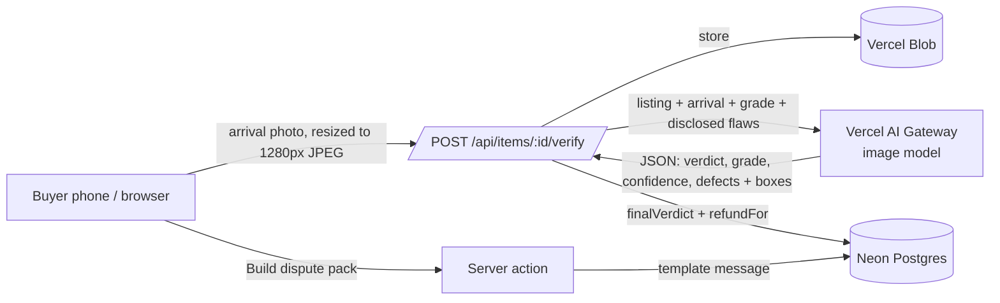

# RFC — Second Look technical shape

Status: implemented for the hackathon · Author: Ayo Ahmed · 26 Sep 2026

## Summary

Second Look is a Next.js app on Vercel. A buyer uploads an arrival photo for a piece. The server sends that photo, together with the listing photo, the claimed grade and the disclosed flaws, to an image model through Vercel AI Gateway. The model returns structured JSON. Deterministic code then turns that JSON into a verdict and a refund, and writes it to Neon Postgres. Building a dispute pack is also deterministic: no language model writes the supplier message.

## Architecture



| Layer | Choice | Why |
|---|---|---|
| App | Next.js 16 App Router, TypeScript, Tailwind v4 | Server components for reads, one route handler for uploads, server actions for state changes |
| DB | Neon Postgres via Vercel Marketplace, `pg` + `attachDatabasePool` | Free, no expiry, and Vercel injects the environment variables. Replaced Supabase after its free project limit was reached. |
| Files | Vercel Blob (public, random suffix) | Arrival photos need a URL that works in the dispute message |
| Image model | AI SDK `generateText` + `Output.object` (Zod) via AI Gateway | Typed output. OIDC auth on Vercel, so there's no key in code. The model can be swapped with the `VISION_MODEL` variable. |

## Data model (`db/migrations/0001_init.sql`)

- `orders(id, supplier, title, claimed_grade, value_gbp, state, delivered_at)`
- `items(id, order_id, position, name, claimed_grade, unit_price_gbp, listing_photo_url, demo_arrival_url, listing_defects jsonb, fallback_result jsonb, received_photo_url, verdict, true_grade, confidence, agent_reason, defects jsonb, refund_gbp, source, verified_at)`
- `disputes(id, order_id unique, message, items_flagged, total_refund_gbp, status, created_at, resolved_at)`

Seed data is in `db/seed.sql`, which is idempotent. Migrations are applied by `scripts/migrate.mjs`, which records each one in a `schema_migrations` table.

## Image model contract (`src/lib/verify.ts`)

The model receives the listing photo, the arrival photo, the piece name, the claimed grade, the grading rubric and the supplier-disclosed flaws. It returns:

```json
{ "verdict": "MATCH|BELOW_GRADE", "true_grade": "A|B|C", "confidence": 0.0,
  "reason": "2–3 sentences",
  "defects": [{ "type": "stain", "severity": "minor|moderate|major",
                "status": "DISCLOSED|NEW|WORSENED", "x": 0, "y": 0, "w": 0, "h": 0, "note": "…" }] }
```

Box coordinates are fractions (0 to 1) of the arrival photo's width and height, so they line up at any screen size.

**Post-processing (`finalVerdict`), where the business rules live, outside the model:**
- confidence below 0.6 → `NEEDS_REVIEW`
- BELOW_GRADE counts only if the true grade is below the claimed grade **and** at least one defect is NEW or WORSENED
- anything contradictory (for example, below grade but only disclosed flaws) → `NEEDS_REVIEW`

**Refund (`refundFor`):** `unit × (1 − factor(true) ÷ factor(claimed))`, where A = 1.0, B = 0.7, C = 0.4. The factors are a demo assumption, kept in one constant.

## Fallback

If there are no Gateway credentials, or the model call fails or times out after 40 seconds, the route uses the seeded `fallback_result` for that piece and marks it `source = 'scripted'`. The UI then shows "Scripted demo verdict (image model not connected)". This keeps the live demo safe and honest.

## State machine (`src/lib/state.ts`)

`DELIVERED → VERIFYING → DISPUTED | CLEAN → RESOLVED`. The server checks this on every write: verification is closed once an order is disputed, clean or resolved.

## Security and privacy

- There are no browser-side database credentials. All reads and writes go through server code.
- Uploads are limited to JPG, PNG or WebP under 4 MB, stored under random names, and resized in the browser.
- `.env*` files are git-ignored, and secrets live in Vercel project environment variables.
- The seed answer key (`fallback_result`) is never sent to the browser.
- There's no auth in the demo. A pilot needs Fleek account auth, per-buyer row scoping, a photo retention policy and consent.

## Limits and when to upgrade

| Limit | Signal to upgrade | Upgrade |
|---|---|---|
| One photo per piece | Buyers dispute details that one angle misses | Several photos per piece, plus capture guidance |
| Approximate boxes | Suppliers dispute where the defect is | Segmentation model, or require a close-up photo |
| Hard-coded grade factors | Pilot refunds drift from agreed amounts | Price curves per category from Fleek sales data |
| No auth | Any real user | Fleek SSO + row-level scoping |
| Synchronous image model call (about 5–15 seconds) | Bales with many pieces | Queue per piece + streaming progress |
